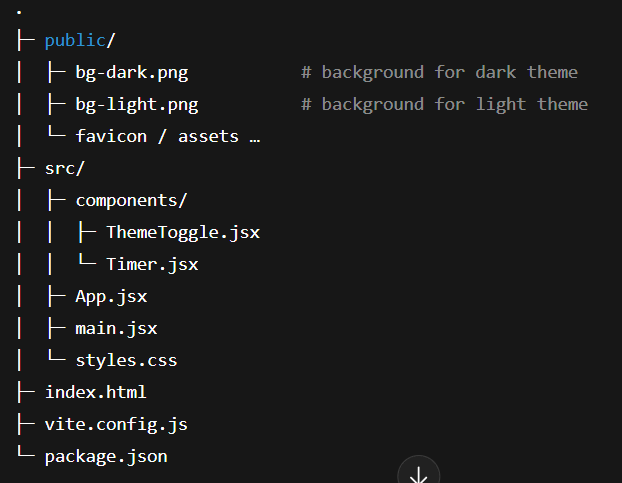

# Bax Focus — Pomodoro Timer (React + Vite)

A clean, Pomodoro timer with dark/light themes, sound alert, configurable durations, and a simple activity log — all saved locally.

 

## ✨ Features

- ⏱️ Focus / Short / Long sessions
- 🔁 Custom cycle length (e.g., long break after 4 focuses)
- 🔔 Optional sound when a session ends (toggle in header)
- 🌗 Dark / Light mode (persists)
- 🧠 Local storage for settings & session history (no backend)
- 📈 Recent sessions list with totals & focus minutes
- 🎨 Subtle patterned background that adapts to theme

## 🧩 Stack

- React + Vite
- Plain CSS (no UI framework)
- localStorage for persistence

## 🚀 Quick start

**install**
- npm install

**dev**
- npm run dev

**build**
- npm run build

**preview the build (optional)**
- npm run preview

---

🗂️ Project structure

---

## Controls

- Click Start / Reset to control the timer

- Click Focus / Short / Long tabs to switch modes

- Use the bell icon to toggle sound

- Use the moon/sun toggle to switch theme

---

🔒 Privacy

All data (settings and logs) is stored only in your browser via `localStorage`.

