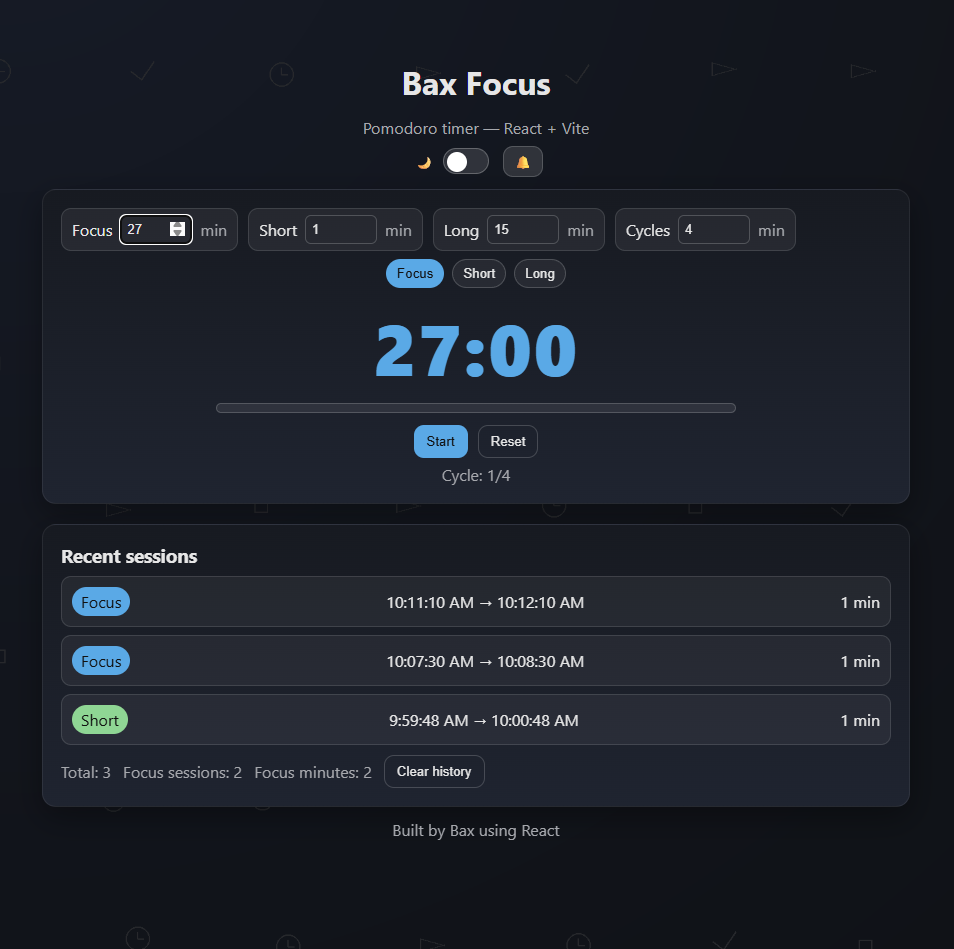
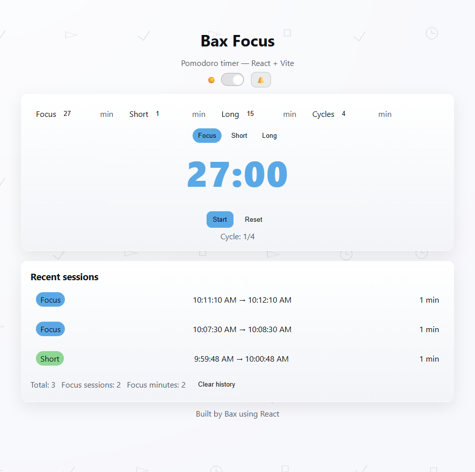

# Bax Focus — Pomodoro Timer (React + Vite)

A clean, portable Pomodoro timer with dark/light themes, sound alert, configurable durations, and a simple activity log — all saved locally.

 

## ✨ Features

- ⏱️ Focus / Short / Long sessions
- 🔁 Custom cycle length (e.g., long break after 4 focuses)
- 🔔 Optional sound when a session ends (toggle in header)
- 🌗 Dark / Light mode (persists)
- 🧠 Local storage for settings & session history (no backend)
- 📈 Recent sessions list with totals & focus minutes
- 🎨 Subtle patterned background that adapts to theme

## 🧩 Stack

- React + Vite
- Plain CSS (no UI framework)
- localStorage for persistence

## 🚀 Quick start

```bash
# install
npm i

# dev
npm run dev

# build
npm run build

# preview the build (optional)
npm run preview
